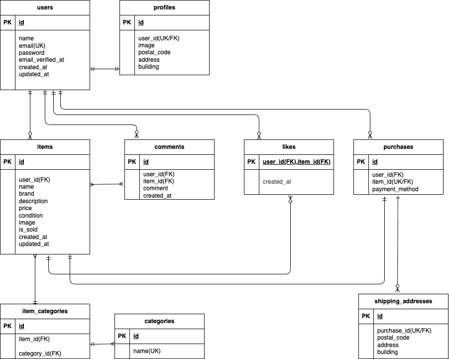

## COACHTECHフリマ
アイテムの出品と購入を行うためのフリマアプリを開発

## 環境構築
git clone https://github.com/hashimo537/mogi11.git

cd mogi11

docker-compose up -d --build

## Laravel環境構築（以下コンテナ内で実行）
docker-compose exec php bash

composer install

cp .env.example .env

php artisan key:generate
php artisan migrate
php artisan db:seed
php artisan storage:link

## Stripe設定
.envにstripeテストキーを設定してください。
STRIPE_KEY=your_stripe_public_key
STRIPE_SECRET=your_stripe_secret_key

M1/M2 Mac をお使いの場合は、docker-compose.yml の該当サービスに platform: linux/amd64 を追加してください。

## 使用技術（実行環境）
- PHP 8.x
- Laravel 8.83.29
- MySQL 8.0
- nginx 1.21.1
- Docker / Docker Compose
- PHPUnit（テスト）
- Eloquent / Factory

## ER図

## URL
- トップ画面：　http://localhost
- ユーザー登録　：　http://localhost/register
- phpMyAdmin:　http://localhost:8080/

## 学んだこと

- Fortifyを利用した会員登録・ログイン・メール認証機能の実装
- Eloquentリレーション（1対1、1対多、多対多）の設計と活用
- Factory・Seederを利用したテストデータ作成
- PHPUnitによる機能テストの作成とデバッグ
- Docker環境でのLaravel開発と環境構築
- Stripeを利用した決済フローの実装
- セッションを利用した購入情報・配送先情報の管理
- GitHubでのバージョン管理と.gitignoreの重要性